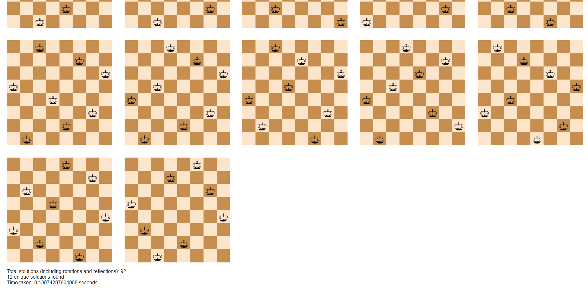

<h1>8QueenProblemMySolution  </h1>
Randomized solution to the 8 Queen problem!

A purely randomized solution to the 8 Queen problem. It takes in a spectacular fashion only (0.2-0.8) S to get all 12 possible solutions 
which is incredibly impressive!. On average it takes about 0.3S!!. There are no permutation algorithms. All solutions uses generated random values from 0 to 7.
The main point of the solution is my noticed fact that Queens which represent binary numbers cannot repeat!. If we avoid repetitions the
solution is way faster. My solution populates layout with binary digits from the array which represents binary Queen positions. The row 
position represents the row and the Queen position represents the place of the Queen in that row !
